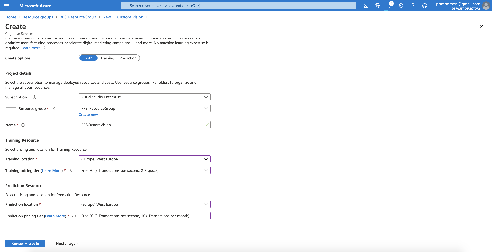
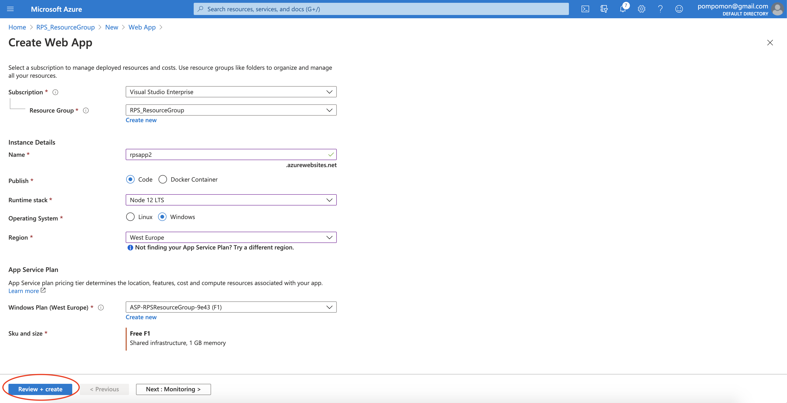
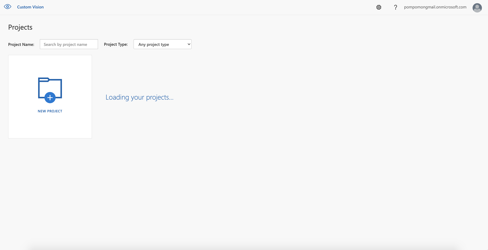
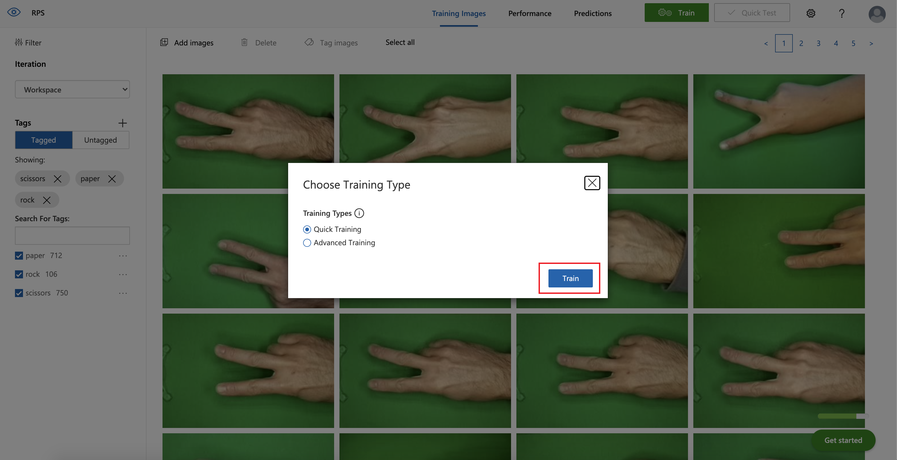

--- 
description: "Code and tutorial for Rock-paper-scissors game used at Azure Custom Vision hands-on workshop"
languages: 
  - javascript
page_type: sample
products: 
  - azure
  - azure-cognitive-services
urlFragment: rock-paper-scissors-customvision
---

# Rock-paper-scissors
Code and tutorial for "Rock-paper-scissors" game used at Azure Custom Vision hands-on workshop.

## Contents

Outline the file contents of the repository. It helps users navigate the codebase, build configuration and any related assets.

| File/folder       | Description                                |
|-------------------|--------------------------------------------|
| `Step{1-6}`       | Sample source code.                        |
| `.gitignore`      | Define what to ignore at commit time.      |
| `README.md`       | This README file.                          |
| `LICENSE`         | The license for the sample.                |

## Prerequisites

1. Azure subscribtion. If you don’t have an Azure subscription, you can [create an Azure free account](https://azure.microsoft.com/free/?WT.mc_id=A261C142F)
2. Install [NodeJS](https://nodejs.org/en/download/)

## Azure setup

### Create a new resource group
1. Open [**Azure Portal**](https://portal.azure.com)
2. Open **Resource groups** module and click on **+ Create** to create new resource group

  
  
3. Fill-in the form the following information for your resource group:
    - **Subscription**: <your_subscription>
    - **Resource group** RPS_ResourceGroup 
    - **Region**: West Europe

  

4.  Click **Review + create**
5. Verify the values and click on **Create**

  

6. Wait until the deployment of the resource group is complete and click on **Go to resource group**

  

### Create a new Custom Vision resource

1. **Open** the resource group you have created. The resource group is empty
2. Click on **Create resources** or **+ Create** to create a new resource

  

3. Search for **Custom Vision** in the Marketplace and click on it

  

4. Click **Create**

  

5. Fill-in the form the following information for your Custom Vision resource:
    - **Create options**: Both
    - **Subscription**: <your_subscription>
    - **Resource group**: RPS_ResourceGroup
    - **Region**: West Europe
    - **Name**: RPSCustomVision
    - **Training pricing tier**: Free F0
    - **Prediction pricing tier**: Free F0

  
  
6.  Click **Review + create**
7. Verify the values and click on **Create**
8. Wait until the deployment of the resource is complete

### Create a new AppService resource

1. **Open** your resource group, verify that you now have two resources with **Custom Vision type** and click on **+ Create** to add another resource

  

2. Search for **Web App** in the Marketplace and click on it

  

3. Click **Create**

  

4. Fill-in the form the following information for your AppService resource:
    - **Subscription**: <your_subscription>
    - **Resource group**: RPS_ResourceGroup 
    - **Name**: <choose_unique_name>
    - **Publish**: Code
    - **Runtime stack**: Node 14 LTS (or higher)
    - **Operating system**: Windows
    - **Region**: West Europe
   
5. Click on **Change size** for App Service Plan

  

6. Select **Dev / Test** plan and **F1** pricing tier, then click **Apply**

  

7. Click **Review + create**

  

8. Verify values and click **Create**

  

9. Wait until the deployment of the Web App is complete and click on **Go to resource**

  
  
10. In your new Web App, on the left panel go to **Settings -> Configuration -> Application Settings**

  

11. Click on **+ New application setting**

  
  
12. Fill-in the following information:
    - **Setting name**: SCM_DO_BUILD_DURING_DEPLOYMENT"
    - **Value**: true

  

13. Click **OK**

  

14. Click **Save**. This will enable build step when we deploy our NodeJS application later

  

15. **Open** your resource group and verify that you have the following resources: **App Service Plan, App Service and two Custom Vision**

  

## Train a model in Custom Vision

1. Sign in [Custom Vision](https://www.customvision.ai/) using your Azure account 
  
  
2. Click **New Project**

3. Fill-in the form 
    - **Name**: RPS
    - **Resource**: RPSCustomVision[F0]
    - **Project Types**: Classification
    - **Classification Types**: Multiclass
    - **Domains**: General
4. Click **Create project**

### Upload and tag images

1. In Custom Vision project click **Add images**

2. **Select** the images and click **Open** to add them
3. Write an appropriate **Tag** for your images (for example, paper), press **Enter** and click **Upload files**

5. Wait until upload is finished

6. **Repeat** the process to add other group of images

### Train a model
1. In Custom Vision project click on **Train**

2. Select **Quick Training** and click **Train**

3. Wait for training to finish. This process can take a few minutes

#### Manual validation

1. Click on **Quick Test**

2. **Upload** a test image

If the prediction of the test image is incorrect, you can correct it and select the right tag.

1. Open **Predictions** tab

2. **Select** the incorrectly predicted image

3. **Assign** correct tag and click **Save and close**

### (Optional) Advanced training
1. In Custom Vision project click **Train**

2. Select **Advanced Training**, choose **1 hour** for training budget, and click **Train**

3. Wait for training to finish

### Publish iteration
1. Open **Performance** tab, select the finished iteration and click **Publish**

2. Fill-in **Model name**, select **RPSCustomVision_Prediction** as prediction resource and click **Publish**

3. Click on **Prediction URL** to see your credentials

## Web application code
Application based on code from [NodeJS app on Azure](https://docs.microsoft.com/en-us/azure/app-service/app-service-web-get-started-nodejs) example.

### Structure

* index.js - server-side logic
* public/index.html - WebApp HTML template
* public/css/app.css - WebApp CSS styles
* public/js/app.js - WebApp Javascript logic

### Local development 
Local development is the same for all the steps:
1. Open "StepN" folder
2. Run `npm install`
3. Run `npm start`
4. Open http://localhost:1337

### Azure deployment 
Azure deployment is the same for all the steps:
1. Open "StepN" folder
2. Create zip archive with contents of "StepN" folder, except for node_modules folder
3. Open <choose_unique_name>.scm.azurewebsites.net
4. navigate to Tools -> Zip Push Deploy
5. Drag-and-drop zip archive to /wwwroot
6. Open <choose_unique_name>.azurewebsites.net and verify that site is running

Code changes are described in respective steps:

[Step 1](Step1/README.md)

[Step 2](Step2/README.md)

[Step 3](Step3/README.md)

[Step 4](Step4/README.md)

[Step 5](Step5/README.md)

[Step 6 (Final)](Step6/README.md)

# Contributing

This project welcomes contributions and suggestions.  Most contributions require you to agree to a
Contributor License Agreement (CLA) declaring that you have the right to, and actually do, grant us
the rights to use your contribution. For details, visit https://cla.opensource.microsoft.com.

When you submit a pull request, a CLA bot will automatically determine whether you need to provide
a CLA and decorate the PR appropriately (e.g., status check, comment). Simply follow the instructions
provided by the bot. You will only need to do this once across all repos using our CLA.

This project has adopted the [Microsoft Open Source Code of Conduct](https://opensource.microsoft.com/codeofconduct/).
For more information see the [Code of Conduct FAQ](https://opensource.microsoft.com/codeofconduct/faq/) or
contact [opencode@microsoft.com](mailto:opencode@microsoft.com) with any additional questions or comments.
