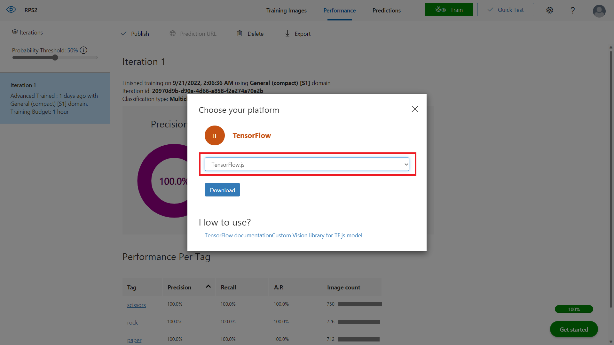

# Step7
Goal:
* Download the Custom Vision model
* Use it locally with tensorflow.js

## Download the model locally

1. Sign in [Custom Vision](https://www.customvision.ai/) using your Azure account 
2. Click **New Project**


3. Fill-in the form to select a compact pre-trained model
    - **Name**: RPS
    - **Resource**: RPSCustomVision[F0]
    - **Project Types**: Classification
    - **Classification Types**: Multiclass
    - **Domains**: General (compact)[S1]
   
4. Click **Create project**
5. Follows the steps in [README.md](../README.md) file to [upload and tag images](../README.md#upload-and-tag-images), and [train a model](../README.md#train-a-model)

6. Click **Export**


7. Select **Tensorflow**


8. Select **Tensorflow.js** and click **Download**



9. **Extract** all the files in `Step7/tf-js-model`

## Changes in public/js/app.js
```javascript
const submitImageFromCanvas = (canvasElement) => {
    const request = new XMLHttpRequest();
    request.open('POST', "/predict_offline", true);
    ...

/* Add another parameter to "toBlob" function to enable compatibility with Tensorflow.js */
canvasElement.toBlob(function(blob) {
    request.send(blob);
}, "image/png");
```

## Changes in index.js
```javascript
const fs = require('fs');
const express = require('express');
const app = express();
const PORT = process.env.PORT || 1337;
const bodyParser = require('body-parser')
const cvstfjs = require("@microsoft/customvision-tfjs-node");

(async () => {
    let labels;
    try {
        const data = fs.readFileSync('tf-js-model/labels.txt').toString();
        labels = data.split('\n');
    } catch {
        console.log("Could not load labels.txt");
    }
    if (!labels)
        return;

    let model;
    try {
        model = new cvstfjs.ClassificationModel();
        await model.loadModelAsync('file://tf-js-model/model.json');
    } catch {
        console.log("Could not load model.json");
        return;
    }

    app.use(bodyParser.urlencoded({ extended: false }))
    app.use(bodyParser.raw({ limit: '10MB' }));
    app.use(express.static('public'));

    app.use(function(req, res, next) {
        res.header("Access-Control-Allow-Origin", "*");
        res.header("Access-Control-Allow-Headers", "Origin, X-Requested-With, Content-Type, Accept");
        next();
    });
    app.post('/predict_offline', async (request, response) => {
        try {
            const imageData = request.body;

            const results = await model.executeAsync(imageData);

            const mostLikelyPrediction = results.map((v, i) => ({
                probability: v,
                tagName: labels[i]
            })).sort((a, b) => {
                return (a.probability > b.probability) ? -1 :
                    (a.probability === b.probability ? 0 : 1)
                    ;
            })[0].tagName;
            response.setHeader('Content-Type', 'text/json');
            response.end(`{ "prediction": "${mostLikelyPrediction}" }`);
        } catch {
            response.status(500);
            response.end();
        }
    });

    app.listen(PORT, () => console.log(`Listening on ${PORT}`));
})();
```
