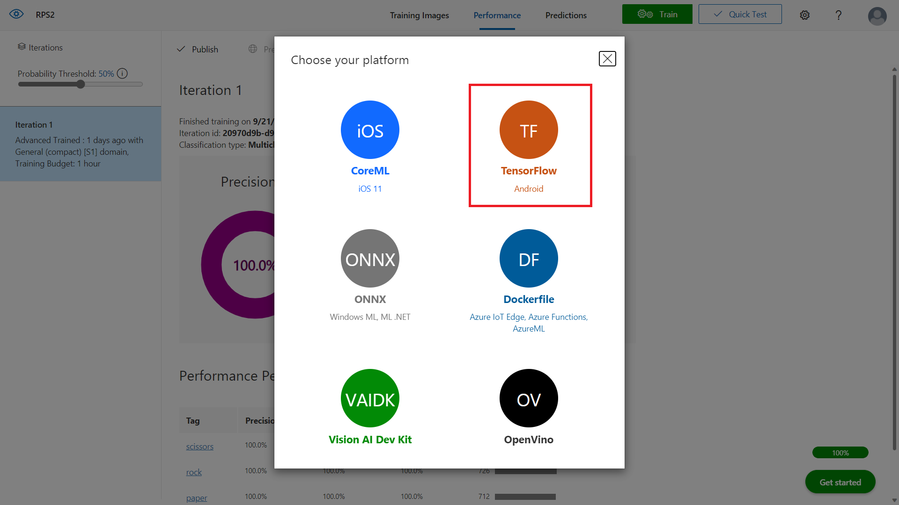

# Step7
Goal:
* Download the Custom Vision model
* Use it locally with tensorflow.js

## Download the model locally

- When creating Custom Vision project select a Compact pre-trained model (<SCREENSHOT>)

- Press Export


- Select Tensorflow



- Select Tensorflow.js and press Download


- Extract all the files in `Step7/tf-js-model`

- In the folder `Step7` run

```
npm install @microsoft/customvision-tfjs-node
```

## Changes in public/js/app.js
```javascript
/* Add another parameter to "toBlob" function to enable compatibility with Tensorflow.js */
canvasElement.toBlob(function(blob) {
    request.send(blob);
}, "image/png");
```

## Changes in index.js
```javascript
const fs = require('fs');
const express = require('express');
const app = express();
const PORT = process.env.PORT || 1337;
const bodyParser = require('body-parser')
const cvstfjs = require("@microsoft/customvision-tfjs-node");

...

app.post('/predict', async (request, response) => {
    const imageData = request.body;

    let labels;
    try {
        const data = (await fs.readFileSync('tf-js-model/labels.txt')).toString();
        labels = data.split('\n');
    } catch (err) {
        console.log(err);
        return;
    }
    
    const model = new cvstfjs.ClassificationModel();
    try {
        await model.loadModelAsync('file://tf-js-model/model.json');
    } catch (err) {
        console.log(err)
        return;
    }

    const results = await model.executeAsync(imageData);
    
    const mostLikelyPrediction = results.map((v, i) => ({
        probability: v,
        tagName: labels[i]
    })).sort((a, b) => {
        return (a.probability > b.probability) ? -1 :
            (a.probability === b.probability ? 0 : 1)
        ;
    })[0].tagName;
    response.setHeader('Content-Type', 'text/json');
    response.end(`{ "prediction": "${mostLikelyPrediction}" }`);
});
```
